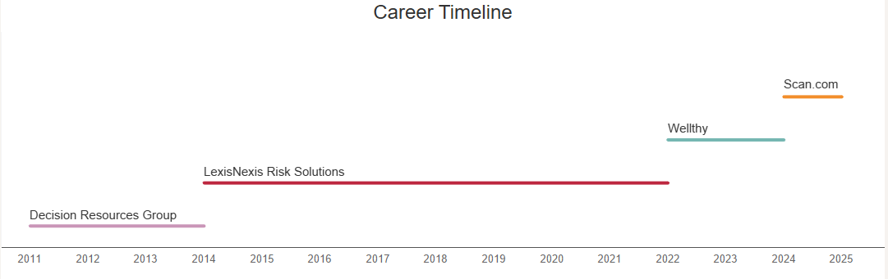

### About Me
I have over 13 years of experience in Data, mostly in the healthcare industry. I take a highly collaborative approach to analytics and believe that a solid understanding of the business is crucial in order to provide valuable insights.

### Technical Skills
* SQL, dbt, Fivetran, Snowflake, GitHub, Hightouch
* Business intelligence tools: Tableau, PowerBI, Mode, ThoughtSpot, Zoho Analytics
* Product analytics tools: Heap, Snowplow, Indicative (mParticle Analytics)

### Current Role

I am a Senior Data Analyst at Scan.com. As the company's first full-time Data employee, my focus is on:
* Establishing data processes and tools
* Overseeing and maintaining the end-to-end data pipeline using Fivetran, dbt, Tableau, and other tools
* Collaborating with stakeholders to establish outcome-based metrics supporting company objectives

### Previous Roles
Please visit my [LinkedIn Profile](https://www.linkedin.com/in/katieshaffer/) for details on my prior roles.

